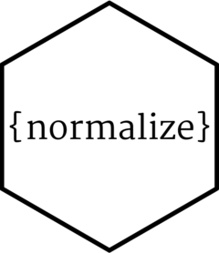

<!-- README.md is generated from README.Rmd. Please edit that file -->

```{r, include = FALSE}
knitr::opts_chunk$set(
  collapse = TRUE,
  comment = "#>"
)
library("normalize")
```

# Normalization of Numeric Data 

<!-- badges: start -->
[](https://github.com/loelschlaeger/normalize/actions/workflows/R-CMD-check.yaml)
[](https://CRAN.R-project.org/package=normalize)
<!-- badges: end -->

`{normalize}` is a small R package that allows for centering and scaling of numeric data. The goal is to extend the base R `scale()` function with some additional features:

- normalizing by row or by column
- ignoring rows or columns when normalizing
- normalizing certain rows or columns jointly
- normalizing over list elements

## Installation

You can install the development version of normalize like so:

``` r
# install.packages("devtools")
devtools::install.github("loelschlaeger/normalize")
```

## Example

We can work on a vector:

```{r}
normalize(1:5)
```

We can work on a matrix:

```{r}
normalize(diag(3))
```

We can work on a data frame:

```{r}
normalize(data.frame(1:3, 2:4))
```

We can work on a list:

```{r}
normalize(list(1:5, diag(3), data.frame(1:3, 2:4)))
```
